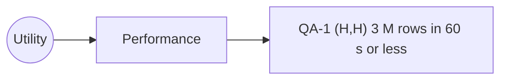

# Quality-attribute scenarios: Angkor Mart monthly sales report

## Stakeholders
- Head-office analyst: Person 1
- Branch manager (PNH, REP, BTB): Person 2 , Person 3 , Person 4

## Scenarios
| ID | Attribute | Source | Stimulus | Artifact | Environment | Response | Response measure | Rank |
|----|-----------|--------|----------|----------|-------------|----------|------------------|------|
| QA-1 | Performance | Scheduler, 06:00 on day 2 of M+1 | Starts the report for a month of about 3 M rows | Report engine | Normal operation, 8-core server, files complete | Report files written, "ready" event published | <= 60 s wall-clock, median of 5 runs after 2 warm-up runs | (H,H) |
| QA-2 | Scalability | | | | | | | |
| QA-3 | Availability | | | | | | | |
| QA-4 | Modifiability | | | | | | | |
| QA-5 | Security | | | | | | | |
| QA-6 | Testability | | | | | | | |

## Rank justifications
- QA-1 (H,H): the report is due in the morning; 3 M rows with BigDecimal ...

## Assumptions
- A1: the report server has 8 cores and an SSD (to confirm with the client).

## Utility tree

## Architectural drivers
QA-?, QA-?, QA-?